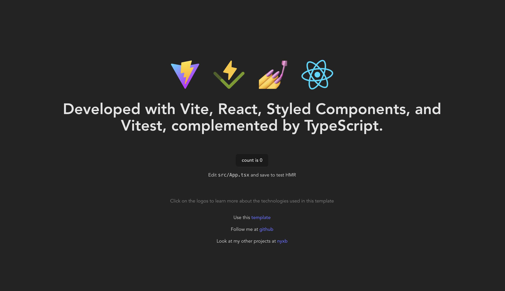

<h1 align="center">
  Vite Template React
</h1>

<p align="center">
  <a href="https://github.com/nyxb/vite-template-react/releases">
    
  </a>
  <a href="https://github.com/nyxb/vite-template-react/blob/main/LICENSE">
    
  </a>
</p>

<p align="center">
    A <a href="https://vitejs.dev">Vite</a> + <a href="https://react.dev">React</a> starter template.
</p>



## Development

To get a local copy of the code, use nyxbi cli:

```
npx nyxbi init -t vite-template-react my-app
```
and follow the instructions. after that, you can run:

```sh
bun dev
```

And then open http://localhost:3000 to view it in the browser.

#### Available Scripts

In this project, you can run the following scripts:

| Script        | Description                                             |
| ------------- | ------------------------------------------------------- |
| bun start     | Runs the app in the development mode.                   |
| bun test      | Launches the test runner in the interactive watch mode. |
| bun run build | Builds the app for production to the `dist` folder.     |
| bun run serve | Serves the production build from the `dist` folder.     |
| bun run test  | Runs tests with vitest.                                 |
| bun run coverage | Runs tests with code coverage                        |

or you can simply use [nyxi](https://github.com/nyxb/nyxi) and just enter `nyxr` and select your script

install it with:

```sh
npm install -g @nyxb/nyxi
```

## Folder Structure

No configuration or complicated folder structures, just the files you need to build your app:

```
vite-template-react
├── public
│   ├── favicon.svg
│   ├── react.svg
│   ├── robots.txt
│   ├── styled-component.svg
│   ├── vite.svg
│   └── vitest.svg
├── src
│   ├── assets
│   │   ├── react.svg
│   │   ├── vite.svg
│   │   └── vitest..svg
│   ├── components
│   │   ├── Avatar
│   │   │   ├── Avatar.test.tsx
│   │   │   ├── Avatar.tsx
│   │   │   └── index.ts
│   │   ├── Card
│   │   │   ├── Card.tsx
│   │   │   └── index.ts
│   │   ├── GlobalStyle
│   │   │   ├── GlobalStyle.tsx
│   │   │   └── index.ts
│   │   └── ImageLink
│   │       ├── ImageLink.test.tsx
│   │       ├── ImageLink.tsx
│   │       └── index.ts
│   ├── test
│   │   ├── App.test.tsx
│   │   └── setup.ts
│   ├── App.tsx
│   ├── constants.ts
│   ├── index.tsx
│   └── logo.svg
├── types
│   ├── bun.env.d.ts
│   ├── custom.d.ts
│   └── vite-env.d.ts
├── LICENSE
├── README.md
├── bun.lockb
├── eslint.config.js
├── index.html
├── package.json
├── tsconfig.json
├── vite.config.ts
└── vitest.config.ts
```

## Styleguide

For coding style, I use [eslint](https://eslint.org/) along with my custom configuration, [@nyxb/eslint-config](https://github.com/nyxb/eslint-config).

## Credits

Vite Template React is built and maintained by [Nyxb](https://nyxb.nexus).

## License

This project is licensed under the terms of the [MIT license](https://github.com/nyxb/vite-template-react/blob/main/LICENSE).
